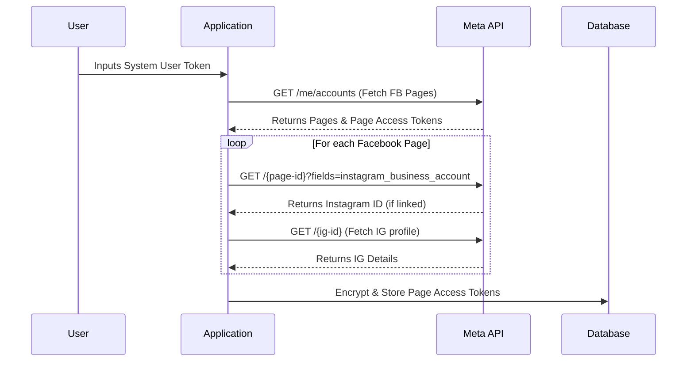
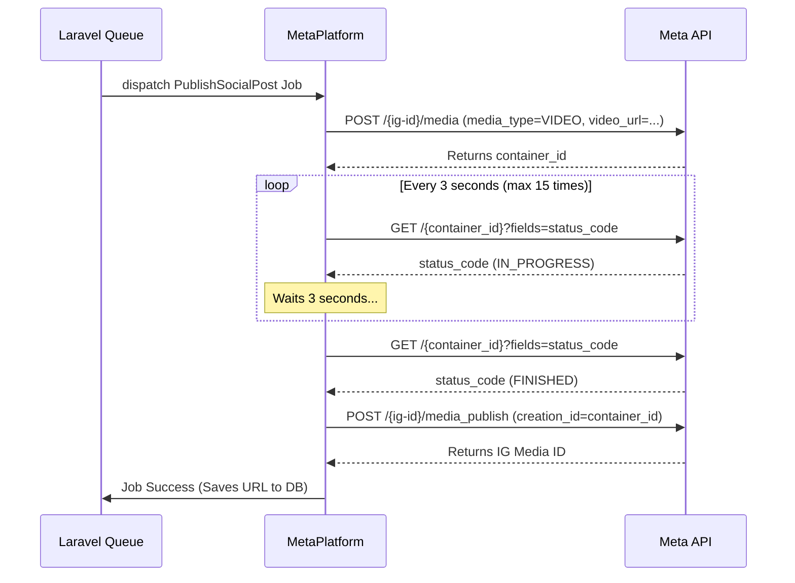

# Meta (Facebook & Instagram) API Integration Documentation

This document explains the architecture, keys, permissions, and implementation details for the Meta Graph API integration within the application. It covers publishing to Facebook Pages and Instagram Business Accounts, including advanced formats like Reels, Stories, and Carousels.

### 🚀 Supported Content Types
The integration fully supports publishing the following formats:
* **Facebook Pages**: Text (Feed), Single Images, Videos, Carousels, Stories (Image/Video), and Reels.
* **Instagram Business Accounts**: Single Images (Feed), Videos (Feed), Carousels, Stories, and Reels. *(Note: The Meta API does not support text-only posts for Instagram).*

---

## 1. Required Keys & Credentials

The application uses the following credentials to authenticate and communicate with the Meta Graph API (v22.0). These are stored in the `social_platforms` database table under the `oauth_config` JSON column.

* **Meta App ID**: The unique identifier for your Meta Developer App.
* **Meta App Secret**: The secret key for your Meta Developer App (used for generating tokens and verifying webhooks).
* **System User Token**: A long-lived access token generated from Meta Business Manager. This token is used to fetch the list of Facebook Pages and Instagram accounts owned by the Business Manager.
* **Webhook Verify Token**: A custom string (e.g., `meta_engine_webhook_secret_2026`) used to verify webhook subscription requests from Meta.
* **Business Portfolio ID**: The ID of the Meta Business Manager account.

---

## 2. Required Meta Permissions (Scopes)

To successfully fetch accounts and publish content, the **System User Token** must be generated with the following permissions:

1. `pages_show_list`: Allows the app to see the list of Facebook Pages you manage.
2. `pages_read_engagement`: Required to read basic data about the Facebook Pages.
3. `pages_manage_posts`: Required to publish content (Text, Image, Video, Reel, Story, Carousel) to Facebook Pages.
4. `instagram_basic`: Allows the app to read basic information about connected Instagram Business accounts.
5. `instagram_content_publish`: Required to publish content (Image, Video, Reel, Story, Carousel) to Instagram Business accounts.

> **Important**: You cannot publish to a Facebook Page using a System User Token directly. The System User Token must be exchanged for a **Page Access Token**, which the application handles automatically.

---

## 3. API Endpoint Flow Diagrams

### A. Account Connection Flow



### B. Publishing Flow (Example: Instagram Video/Reel)



---

## 4. How the Application Flow Works

### A. Connecting Accounts
1. The user navigates to the Social Connections UI and enters their System User Token.
2. The backend (`SocialConnectionController::fetchAccounts()`) calls the Meta API: `GET /me/accounts`.
3. The API returns a list of Facebook Pages and their associated **Page Access Tokens**.
4. The system also checks if each Page has a linked `instagram_business_account`. If so, it fetches the Instagram Account details.
5. The application encrypts the **Page Access Token** and saves it in the `social_connections` database table (`encrypted_access_token` column). 

### B. Publishing Content
1. The user creates a post in the Application UI, selects platforms (e.g., Facebook, Instagram), attaches media, and selects a content type (Text, Image, Video, Reel, Story, Carousel).
2. The `PublishSocialPost` Laravel Queue Job is dispatched.
3. The Job reads the `encrypted_access_token` from the database, decrypts it, and passes it to `MetaPlatform.php`.
4. `MetaPlatform.php` routes the request to the correct Meta API endpoints based on the platform and content type.

---

## 4. Implementation Details by Content Type (`MetaPlatform.php`)

### Facebook Page
* **Text**: Posts directly to `/{page-id}/feed` with the `message` parameter.
* **Image**: Posts directly to `/{page-id}/photos` with the `url` parameter.
* **Video**: Posts directly to `/{page-id}/videos` with the `file_url` parameter.
* **Carousel**: Multi-step process. Uploads each photo as unpublished (`published=false`), collects their media IDs, and then publishes to `/{page-id}/feed` using the `attached_media` array.
* **Story (Image & Video)**: Posts directly to `/{page-id}/photo_stories` or `/{page-id}/video_stories`. (No captions are sent via API for Stories).
* **Reel**: Requires a complex 3-step upload process:
  1. `upload_phase=start` to initialize and get an `upload_url` and `video_id`.
  2. Downloads the video file into memory and POSTs the raw binary data to the `upload_url`.
  3. `upload_phase=finish` to finalize the upload and publish it to the Reel feed.

### Instagram Business
*Note: Instagram does not support Text-only posts via API. All Instagram posts require an Image or Video.*

* **Image**: Posts to `/{ig-user-id}/media` with `media_type=IMAGE`, then publishes using `/{ig-user-id}/media_publish`.
* **Video**: Posts to `/{ig-user-id}/media` with `media_type=VIDEO`. **Crucially**, Instagram processes videos asynchronously. The application polls the container status every 3 seconds until it returns `FINISHED` before calling `media_publish`.
* **Reel**: Posts to `/{ig-user-id}/media` with `media_type=REELS`. Also uses the asynchronous polling mechanism before publishing.
* **Story (Image & Video)**: Posts to `/{ig-user-id}/media` with `media_type=STORIES`. Uses the polling mechanism before publishing.
* **Carousel**: Multi-step process. Posts each image/video to `/{ig-user-id}/media` with `is_carousel_item=true` to get child IDs. Then creates a master container with `media_type=CAROUSEL` and the `children` array. Finally, calls `media_publish`.

---

## 5. Exhaustive Endpoint Payloads (Zero-to-Hero Reference)

If you are expanding this system or debugging, here are the exact structural requests the application is making to the Meta Graph API under the hood.

### A. Facebook Page Text Post
```http
POST https://graph.facebook.com/v22.0/{page-id}/feed
```
**Required Payload (JSON):**
```json
{
  "access_token": "EAAZ...",
  "message": "Your text caption here\n\n#hashtags"
}
```

### B. Facebook Page Single Image
```http
POST https://graph.facebook.com/v22.0/{page-id}/photos
```
**Required Payload (JSON):**
```json
{
  "access_token": "EAAZ...",
  "message": "Caption goes here",
  "url": "https://your-app.com/public/images/test.jpg"
}
```

### C. Facebook Page Reel (3-Step Binary Upload)
*Because video files can be large, Meta requires a three-step process for Reels.*

**Step 1: Initialize**
```http
POST https://graph.facebook.com/v22.0/{page-id}/video_reels
```
*Payload:* `{"upload_phase": "start", "access_token": "EAAZ..."}`
*Returns:* `video_id` and `upload_url`.

**Step 2: Upload Binary Data**
```http
POST {upload_url}
```
*Headers Required:*
- `Authorization: OAuth EAAZ...` (Note: Uses 'OAuth' prefix, not 'Bearer')
- `offset: 0`
- `file_size: {size_in_bytes}`
*Body:* Raw binary bytes of the `.mp4` file (`application/octet-stream`).

**Step 3: Publish**
```http
POST https://graph.facebook.com/v22.0/{page-id}/video_reels
```
*Payload:*
```json
{
  "upload_phase": "finish",
  "video_id": "{video_id_from_step_1}",
  "video_state": "PUBLISHED",
  "description": "Your caption here",
  "access_token": "EAAZ..."
}
```

### D. Instagram Video / Reel / Story (Asynchronous)
Instagram handles all videos, reels, and stories through a 2-step async process.

**Step 1: Create Container**
```http
POST https://graph.facebook.com/v22.0/{ig-user-id}/media
```
*Payload:*
```json
{
  "media_type": "REELS", // Or "VIDEO", "STORIES"
  "video_url": "https://your-app.com/video.mp4",
  "caption": "Your caption here",
  "access_token": "EAAZ..."
}
```
*Returns:* `id` (This is the container ID, NOT the published post ID).

**Step 2: Polling & Publishing**
* You must poll `GET /{container-id}?fields=status_code` until the status is `FINISHED`.
* Then you finalize it:
```http
POST https://graph.facebook.com/v22.0/{ig-user-id}/media_publish
```
*Payload:* `{"creation_id": "{container-id}", "access_token": "EAAZ..."}`

---

## 6. Webhooks Integration (Zero-to-Hero Setup)

Webhooks allow Meta to push real-time notifications to your application (e.g., when a user comments on your post, sends you a DM, or if a scheduled post fails).

### Step 1: Meta Developer Dashboard Setup
1. Go to your Meta App Dashboard -> Webhooks.
2. Click **Subscribe to an Object** (e.g., `Page` or `Instagram`).
3. Callback URL: `https://your-app-domain.com/webhooks/meta`
4. Verify Token: Enter the exact string stored in your application database `social_platforms` table under `webhook_verify_token` (e.g., `meta_engine_webhook_secret_2026`).

### Step 2: Code Implementation (`MetaWebhookController.php`)
* **Endpoint**: `GET/POST /webhooks/meta`
* **Verification (GET)**: When you click "Verify and Save" in Meta, they send a `GET` request. The Application validates the `hub_verify_token` against the DB, and if it matches, returns the `hub_challenge` in plain text.
* **Event Handling (POST)**: When an actual event happens, Meta sends a `POST` request. Your application will receive a JSON payload containing the `entry` array, which holds all the new messages, comments, or changes.

---

## 7. Developer Quick Reference

If you are a developer taking over this project, here is the ultimate cheat sheet of where things are:

- **Where are App Secrets stored?** In the `social_platforms` table, inside the `oauth_config` JSON column.
- **Where are Page Access Tokens stored?** In the `social_connections` table, inside the `encrypted_access_token` column (Encrypted using Laravel's native Encrypter).
- **Where is the Publishing Logic?** `app/Social/Platforms/MetaPlatform.php`
- **Where is the Webhook Logic?** `app/Http/Controllers/Webhook/MetaWebhookController.php`
- **Where do background API tests live?** Look at `test_all.php` or `test_everything.php` in the root folder for functional examples of how models and jobs interact with the platform adapter.

---

## 8. Fetching & Filtering Media (Latest vs. Top Trending)

The package includes dedicated `Fetcher` classes to retrieve and filter your published media. You can fetch either the **Latest** (chronological) or the **Top Trending** (sorted by engagement: likes + comments) for any specific media type.

### A. Fetching from Instagram (Latest vs Top)
```php
use Vendor\LaravelMeta\Facades\Meta;

$igUserId = 'YOUR_IG_USER_ID';

// --- LATEST (Chronological) ---
$latestVideos = Meta::instagramFetcher()->getLatest($igUserId, 10, 'VIDEO');
$latestReels  = Meta::instagramFetcher()->getLatest($igUserId, 10, 'REELS');
$latestImages = Meta::instagramFetcher()->getLatest($igUserId, 10, 'IMAGE');
$allLatest    = Meta::instagramFetcher()->getLatest($igUserId, 10); // All types

// --- TOP TRENDING (Sorted by Likes + Comments) ---
$topVideos = Meta::instagramFetcher()->getTop($igUserId, 10, 'VIDEO');
$topReels  = Meta::instagramFetcher()->getTop($igUserId, 10, 'REELS');
$topImages = Meta::instagramFetcher()->getTop($igUserId, 10, 'IMAGE');
```

### Saving Fetched Data to Your Database
The Meta Graph API returns many fields (`id`, `caption`, `media_url`, `media_product_type`, `permalink`, `like_count`, `comments_count`). Here is how you can loop through the response and save it to your local database:

```php
// Example: Saving Instagram Media to a local `posts` table
$response = Meta::instagramFetcher()->getMedia($igUserId, 50); // Get latest 50

foreach ($response['data'] as $media) {
    DB::table('posts')->updateOrInsert(
        ['platform_id' => $media['id']], // Unique constraint
        [
            'caption'      => $media['caption'] ?? '',
            'media_url'    => $media['media_url'] ?? '',
            'media_type'   => $media['media_type'] ?? 'UNKNOWN', // IMAGE, VIDEO, CAROUSEL_ALBUM
            'product_type' => $media['media_product_type'] ?? null, // e.g. REELS
            'permalink'    => $media['permalink'] ?? '',
            'likes'        => $media['like_count'] ?? 0,
            'comments'     => $media['comments_count'] ?? 0,
            'posted_at'    => \Carbon\Carbon::parse($media['timestamp']),
        ]
    );
}
```

### C. Fetching from Facebook (Latest vs Top)
You can do the exact same thing for Facebook Pages using the specific media type ('posts', 'reels', 'videos', 'photos'):

```php
$pageId = 'YOUR_PAGE_ID';

// --- LATEST (Chronological) ---
$latestPosts  = Meta::facebookFetcher()->getLatest($pageId, 'posts', 10);
$latestReels  = Meta::facebookFetcher()->getLatest($pageId, 'reels', 10);
$latestVideos = Meta::facebookFetcher()->getLatest($pageId, 'videos', 10);
$latestPhotos = Meta::facebookFetcher()->getLatest($pageId, 'photos', 10);

// --- TOP TRENDING (Sorted by Likes + Comments) ---
$topPosts  = Meta::facebookFetcher()->getTop($pageId, 'posts', 10);
$topReels  = Meta::facebookFetcher()->getTop($pageId, 'reels', 10);
$topVideos = Meta::facebookFetcher()->getTop($pageId, 'videos', 10);
```

---

## 9. End-to-End Automated Testing

The package includes a comprehensive, built-in automated testing command. This command verifies that your credentials work, generates lightweight dummy media (`.jpg` and `.mp4`), and attempts to publish all possible formats (Text, Images, Videos, Reels) to Facebook and Instagram. It then fetches them to verify and cleans up Facebook posts automatically.

### Running the Test

If you have installed the package via Composer (`composer require meta-engine/laravel-meta`), you can run the test directly from your artisan console:

```bash
php artisan meta:e2e-test
```

**Requirements:**
1. Your `.env` file must be populated with `META_DEVELOPER_APP_ID`, `META_DEVELOPER_APP_SECRET`, and a valid `META_SYSTEM_USERS_ACCESS_TOKEN`.
2. The System User Token must have the correct permissions (`pages_manage_posts`, `instagram_content_publish`, etc.).

*Note: Instagram's Graph API does not support programmatic deletion, so the test script will output the IDs of the generated Instagram posts and ask you to delete them manually via the Instagram app.*
