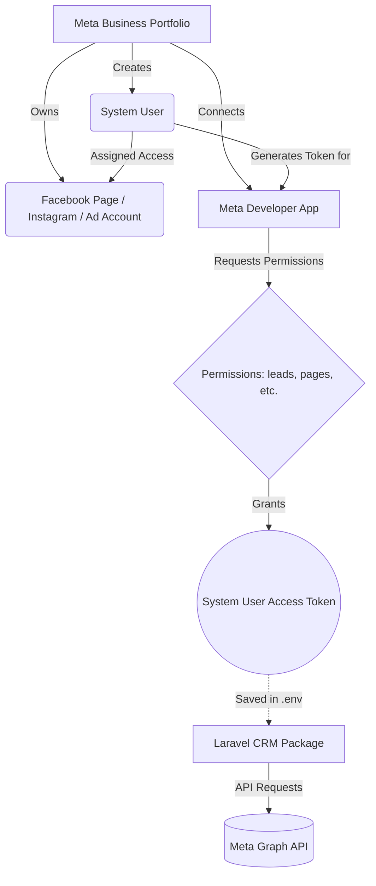
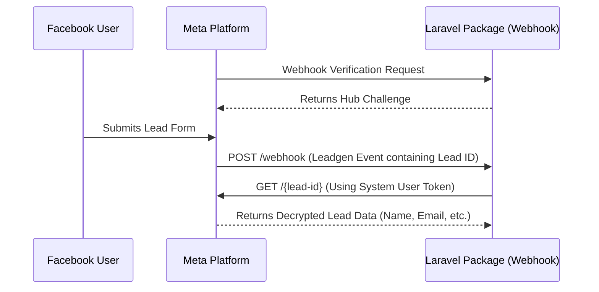

# Token, Permissions, and Authentication Guide

This guide explains the complete flow of generating a Meta Access Token, assigning the correct permissions, and configuring your Laravel package to communicate with the Meta Graph API.

---

## 1. System User & Token Flow (Graphical View)

Here is a step-by-step visual representation of how a System User token connects your CRM to Meta:



---

## 2. Complete Token Generation Flow

### Step A: Create a Meta Business Portfolio
1. Go to [Meta Business Settings](https://business.facebook.com/settings).
2. If you don't have a Business Portfolio, create one. You must have admin access to the portfolio.

### Step B: Create a Meta App (Developer Account)
1. Go to the [Meta App Dashboard](https://developers.facebook.com/apps).
2. Click **Create App**.
3. Select **Other** > **Business** as the app type.
4. Note your **App ID** and **App Secret** (found in App Settings > Basic).
5. In your Business Settings (under **Accounts > Apps**), ensure your newly created App is connected to your Business Portfolio.

### Step C: Create a System User (Business Account)
1. Go back to [Meta Business Settings](https://business.facebook.com/settings).
2. On the left sidebar, navigate to **Users** > **System Users**.
3. Click **Add**.
4. Name your system user (e.g., "CRM API User") and select **Admin** as the system user role.
5. Click **Create System User**.

### Step D: Assign Assets to the System User
The System User needs permission to access your specific Meta assets.
1. Select your new System User.
2. Click **Add Assets**.
3. Select **Pages** and choose the Facebook Page you want to manage. Turn on **Manage Page** (or the specific permissions you need).
4. Repeat for **Instagram Accounts** and **Ad Accounts** if required.
5. Save Changes.

### Step E: Generate the Token
1. With the System User selected, click **Generate New Token**.
2. Select your App from the dropdown.
3. Select the required permissions (see the specific Use Cases below).
4. Click **Generate Token**.
5. **COPY THIS TOKEN IMMEDIATELY**. Meta will only show it once. This is the token you will use in your `.env` file.

---

## 3. Strict Permission Use-Cases

When generating the token, **only select the permissions you need**. Selecting unnecessary permissions can cause your app to require App Review unnecessarily. 

### Use Case 1: ONLY Lead Ads via Webhook (No Publishing)
If your CRM only needs to receive leads automatically when someone fills out a form.

**Permissions Required to Generate Token:**
* `leads_retrieval`
* `pages_show_list`
* `pages_read_engagement`
* `pages_manage_ads`

**Webhook Setup Flow:**

**To configure the Webhook:** 
1. Go to your App Dashboard -> Webhooks -> Select "Page".
2. Subscribe to the `leadgen` field.
3. Provide your Laravel route URL and the `META_WEBHOOK_VERIFY_TOKEN` you set in `.env`.

### Use Case 2: ONLY Facebook Page Publishing
If your CRM only needs to post text, images, or videos to a Facebook page.

**Permissions Required to Generate Token:**
* `pages_show_list`
* `pages_read_engagement`
* `pages_manage_posts`
* `pages_manage_metadata` (required in some API versions)

### Use Case 3: ONLY Instagram Publishing
If your CRM auto-posts photos/reels to Instagram.

**Permissions Required to Generate Token:**
* `instagram_basic`
* `instagram_content_publish`
* `pages_show_list` (Required because IG accounts are tied to FB pages)
* `pages_read_engagement`

### Use Case 4: Full Ads Management
If your CRM creates and manages campaigns.

**Permissions Required to Generate Token:**
* `ads_management`
* `ads_read`

---

## 4. Enabling the Process in Laravel

Once you have your App ID, App Secret, and System User Token, add them to your CRM's environment file.

**`.env`**
```env
META_GRAPH_VERSION=v19.0
META_APP_ID=your_app_id_here
META_APP_SECRET=your_app_secret_here
META_APPSECRET_PROOF_ENABLED=true

# If using Direct API Mode (no database):
META_TEST_ACCESS_TOKEN=your_system_user_token_here

# For Webhook Verification (Use Case 1)
META_WEBHOOK_VERIFY_TOKEN=my_secure_random_string
```

### Usage Example
```php
use Vendor\LaravelMeta\Facades\Meta;

// 1. Fetching a Lead
$client = Meta::client()->setAccessToken(env('META_TEST_ACCESS_TOKEN'));
$lead = Meta::leads()->get('1234567890');

// 2. Publishing to Facebook
Meta::facebook()
    ->page('your_page_id')
    ->publishText('Hello from the CRM API!');
```

---

## 5. Security Best Practices
1. **Never commit your token**: Always store it in `.env` or an encrypted database column.
2. **App Secret Proof**: Keep `META_APPSECRET_PROOF_ENABLED=true`. The `laravel-meta` package will automatically hash your token with your App Secret on every request, ensuring that even if your token leaks, it cannot be used without the App Secret.
3. **Least Privilege**: Only assign the permissions your CRM actually needs based on the exact Use Case above.
